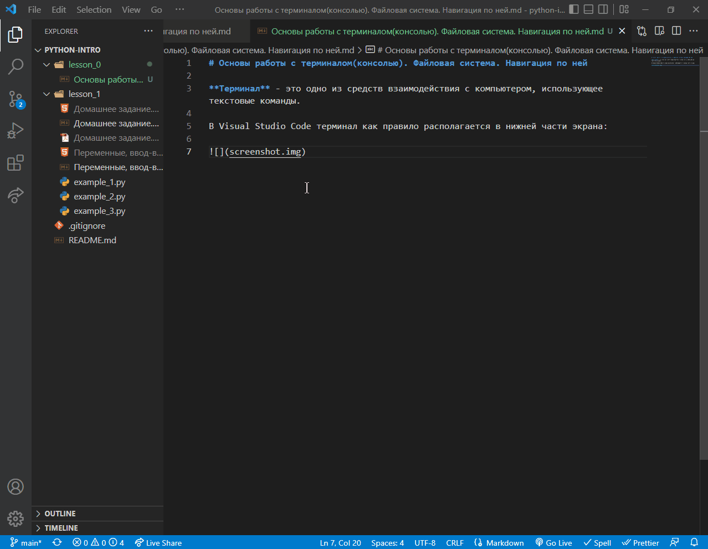

# Основы работы с терминалом(консолью). Файловая система. Навигация по ней

**Терминал** - это одно из средств взаимодействия с компьютером, использующее текстовые команды.

В Visual Studio Code терминал как правило располагается в нижней части экрана:

